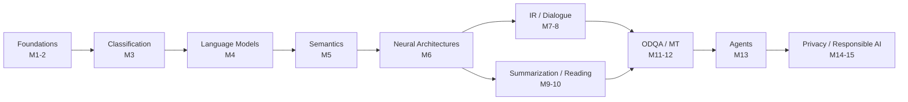

# CS 7650 · Natural Language Processing

秋季学期笔记。教材为 Jurafsky & Martin, *Speech and Language Processing* (3rd ed.)。

!!! tip "怎么用这套笔记"
    每个模块一页，看完 lecture 当天先把「一句话总结」和「核心概念」写掉，
    Quiz 做完再回来补「易错点」。作业相关内容不放在这里，见仓库根目录的 `hw-private/`。

## 模块索引

| # | 模块 | 周次 | 教材 |
|---|------|------|------|
| 1 | [Intro to NLP](module-01-intro.md) | Week 1 | Ch 1, Appendix A |
| 2 | [Foundations](module-02-foundations.md) | Week 1 | Ch 1, Appendix A |
| 3 | [Classification](module-03-classification.md) | Week 2 | Ch 2, 3 |
| 4 | [Language Models (Part 1 & 2)](module-04-language-models.md) | Week 3–4 | Ch 6 |
| 5 | [Semantics](module-05-semantics.md) | Week 5 | Ch 14 |
| 6 | [Modern Neural Architectures (Part 1 & 2)](module-06-neural-arch.md) | Week 6–7 | — |
| 7 | [Information Retrieval](module-07-ir.md) | Week 8 | — |
| 8 | [Task-Oriented Dialogue](module-08-dialogue.md) | Week 9 | Ch 19 |
| 9 | [Summarization](module-09-summarization.md) | Week 10 | Ch 11 |
| 10 | [Machine Reading](module-10-machine-reading.md) | Week 10 | Ch 11 |
| 11 | [Open-Domain Question Answering](module-11-odqa.md) | Week 11 | Ch 18 |
| 12 | [Machine Translation](module-12-mt.md) | Week 12 | — |
| 13 | [Agents and Reasoning](module-13-agents.md) | Week 13 | — |
| 14 | [Privacy-Preserving NLP](module-14-privacy.md) | Week 14 | — |
| 15 | [Responsible AI](module-15-responsible-ai.md) | Week 15 | — |

## 主题脉络

## 待补的坑

- [ ] 
